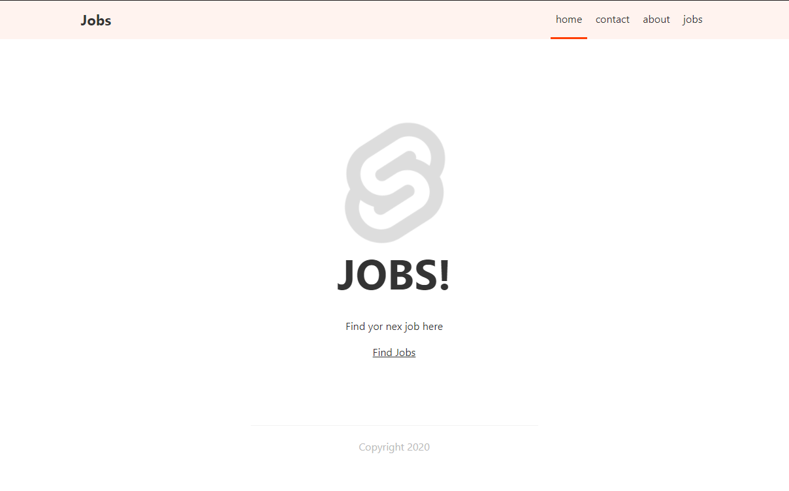
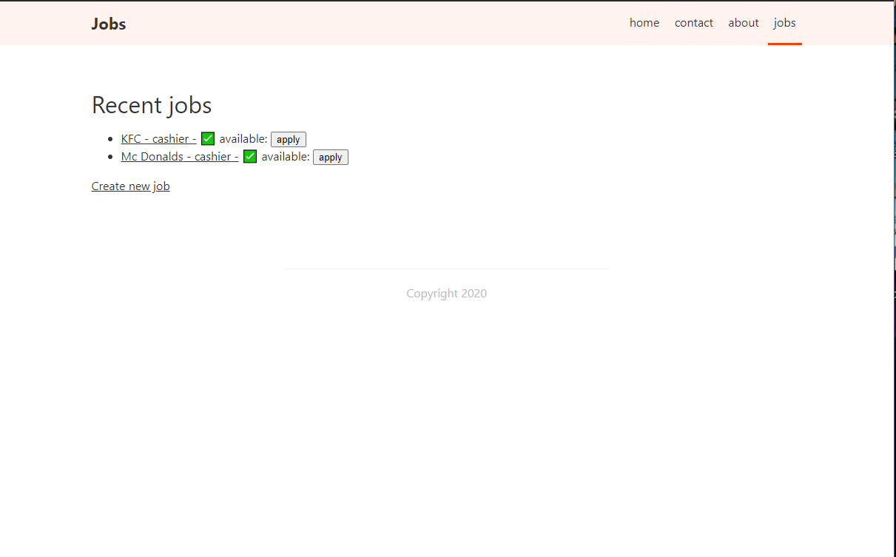

# Job Platform

This project build with [Sapper](https://github.com/sveltejs/sapper).
Project is like linkedin you can add jobs and apply to jobs. It is just demo app for demonstrating power of [Sapper](https://github.com/sveltejs/sapper) and [Svelte](https://github.com/sveltejs/svelte).

## Screenshots



## Getting started

### Running the project

Once you have created the project, install dependencies and run the project in development mode:

```bash
cd job-platform
npm install
npm run dev
```

This will start the development server on [localhost:3000](http://localhost:3000).


### src

The [src](src) directory contains the entry points for  app
